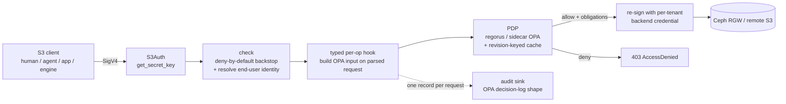

# s0

**An OPA/ABAC-enforcing, S3-compatible authorization gateway.**

s0 is a self-owned S3 authorization gateway. It fronts heterogeneous object-storage
backends (Ceph RGW and remote S3) and enforces one access model uniformly, with **OPA**
as the policy brain. It is built in Rust on the [`s3s`](https://github.com/Nugine/s3s)
crate, which handles the S3 protocol and SigV4.

It is **not** a byte proxy with an authorization hook bolted on. `s3s` deserializes each
request into a typed value; OPA decides on *that* value; and `s3s-aws` re-issues the
request to the backend **from the same value**. Every operation it supports is one it
owns; operations it does not own are denied, not passed through.

> Enforcement lives in the gateway's own policy, never in a backend-native feature — so
> one model holds over Ceph today and a "dumb" S3 backend tomorrow, with one per-user
> audit trail. For regulated deployments, **every object access — human, app, or engine —
> is authorized as the end-user and recorded as one OPA decision.**

## Request path



The `s3s` pipeline (verified against 0.14.1 — see [`docs/substrate-api.md`](docs/substrate-api.md)):
SigV4 verify → region → `S3Access::check` (no body) → body buffer → deserialize →
**typed `S3Access` hook (full parsed input)** → `S3::<op>` → backend.

## What it enforces

- **Object-level, per-prefix, per-operation** authorization — not bucket-granular. The
  rego consumes a per-subject/per-bucket/per-op grant with object-prefix scopes
  ([`policy/gateway/authz.rego`](policy/gateway/authz.rego)).
- **Blind spots the in-backend hook cannot see**, all authorized on the parsed request:
  - CopyObject **source** (authorizes source read *and* dest write),
  - multi-delete **keys** (authorizes *each* key; strips denied keys from the forward),
  - POST form-upload **key**.
- **List scoping, AWS-shaped**: an **unbounded** `ListObjectsV2` — no prefix at all — is
  **denied** for a prefix-scoped principal, exactly as `s3:ListBucket` + an `s3:prefix`
  condition denies it in AWS. A prefix *wider* than the grant but overlapping it is
  rewritten down to the grant (or fanned out across several) instead of enumerating the
  whole bucket. Narrowing where the caller named no scope was dropped on 2026-08-09: a
  filtered listing returned with no signal that it is filtered reads as the whole bucket.
- **Live policy / live revocation**: OPA holds the policy; a revoked grant denies on the
  next request. No policy is baked into credentials.
- **`freeze_writes`** org kill-switch and per-bucket denylist, plus the grant superset.

## Policy: pushed, not baked in

The **platform is the source of policy**. It projects per-tenant grant data and pushes it
— optionally with the rego module itself — to the gateway as a bundle. The gateway is
policy-content-agnostic: it enforces whatever bundle is pushed, and a revocation lands on
the next request.

Two engines sit behind one `Pdp` trait:

- **Sidecar OPA** — the shipping default. OPA is fed the bundle out-of-band; the gateway
  calls it over loopback.
- **Embedded regorus** — the in-process fast path, permitted in production only behind a
  dual-engine parity gate (the two engines must agree byte-for-byte; see
  [ADR-005](docs/adr/ADR-005-pdp-engine-posture-and-parity-gate.md)). It loads the pushed
  module in-process.

A bundle may carry `{ "policy": "<rego>", "data": { … } }`, or just the data — in which
case the gateway falls back to the compiled-in default policy
([`policy/gateway/authz.rego`](policy/gateway/authz.rego)). That default is also the
local-development policy and the oracle the parity gate replays against.

## Own STS (no secret at rest, revocation stays live)

The gateway verifies inbound SigV4 itself. For STS sessions the **secret is derived**
`HMAC(master_keys[kid], kid ‖ sid)` from the access-key id — no per-session secret is
stored and no hot-path lookup happens. The session **claims** (sub, groups, tenant, org,
expiry) ride in a signed token bound to the same `sid`. Revocation stays live because
policy lives in OPA, not the token ([`src/auth/sts.rs`](src/auth/sts.rs)). An optional
OIDC mint exchanges an identity-provider token for a gateway session
([`src/mint.rs`](src/mint.rs)).

Access-key ids are `HFST<kid>.<sid>`. The `kid` names the master key that derived the
secret, which is what makes master-key rotation *online*: because the secret is derived
rather than stored, replacing the key would otherwise 403 every live session at once,
with no signal distinguishing it from a fleet-wide auth outage. With the ring, retiring a
key is a deliberate step taken one session-TTL after the new one starts minting:

```jsonc
"sts": { "master_keys": { "k0": "<hex>", "k1": "<hex>" }, "current_kid": "k1", … }
//  1. add k1, deploy        2. current_kid → k1, deploy   (k0 still verifies)
//  3. wait session_ttl_secs 4. delete k0, deploy          (stragglers fail closed)
```

The **signing** key is not yet a ring: the token names its master key but not its signing
key, so replacing it invalidates live sessions. Rotate it in a window.

## Module map

| Module | Role |
|---|---|
| [`authz`](src/authz) | OPA input contract + decision/obligations — the core seam |
| [`pdp`](src/pdp) | `Pdp` trait; embedded regorus (`CompiledPolicy`) + sidecar OPA; revision-keyed cache |
| [`auth`](src/auth) | identity authority + own STS (derived session secrets, no secret at rest) |
| [`access`](src/access) | the OPA gate: deny-by-default `check` + typed per-op hooks |
| [`proxy`](src/proxy) | per-`(backend, tenant)` client pool + dispatch over `s3s_aws::Proxy` |
| [`audit`](src/audit) | one reasoned decision record per request, async, non-blocking, disk-spill |
| [`gateway`](src/gateway.rs) / [`server`](src/server.rs) | assembly + hardened hyper serving |
| [`admin`](src/admin.rs) / [`shutdown`](src/shutdown.rs) | `/healthz` `/readyz` `/metrics` on their own port; one signal, ordered drain |
| [`internal`](src/internal.rs) | the **authenticated** control-plane surface: `POST /internal/v1/sts/sessions`, on a port of its own |
| [`mint`](src/mint.rs) / [`webidentity`](src/webidentity.rs) | the credential door an S3 client uses: `Action=AssumeRoleWithWebIdentity` in the AWS STS wire protocol, on a port of its own |

## Listeners

Four, on four ports, with three different auth postures. **Which posture applies is a
property of the socket, never of the path** — the one design rule here, because a port
where "is this authenticated?" is answered by a route match is how a mint ends up
answering anonymously.

| Port | What | Authentication | Exposure |
|---|---|---|---|
| `listen` (8014) | the S3 data plane | SigV4, per-request authorization | Ingress-fronted; public |
| `admin_listen` (8016) | `/healthz` `/readyz` `/metrics` | **none, by construction** — a kubelet probe cannot present a secret | Service (scraping/probes) only. Never the ingress. |
| `sts_mint.listen` (8015) | **`Action=AssumeRoleWithWebIdentity`** (the AWS STS wire protocol), plus the older bearer-OIDC → session exchange | **none, by design** — a valid web identity token *is* the credential, exactly as at `sts.amazonaws.com` | optional; absent unless configured. Ingress-fronted on its **own hostname** when it is. |
| `internal.listen` (8017) | `POST /internal/v1/sts/sessions` | `X-Shared-Secret`, constant-time | **the console only.** Never the ingress, never the data plane. |

**Two of these mint credentials, and they are not the same socket on purpose.** 8017 is
the control plane's door: shared-secret authenticated, never public, and it accepts
*assertions* about a caller the console has already authenticated. 8015 is the client's
door: public, unauthenticated because the OIDC token is the credential, and it accepts
no assertions at all — it derives the principal from the token, the tenant from the
`RoleArn`, and the organization from s0's own routing table. Collapsing them would put
the shared-secret boundary behind a routing decision, which is precisely the failure the
rule above exists to prevent. `GatewayConfig::validate` refuses a config in which any
two of the four share a port.

### Getting a credential ([`webidentity`](src/webidentity.rs))

Every S3 SDK can obtain one with stock configuration — the same shape an EKS pod uses
for IRSA, because it is the same call:

```
AWS_ROLE_ARN=arn:aws:iam::<tenant>:role/<tenant>-sts-role
AWS_WEB_IDENTITY_TOKEN_FILE=/var/run/secrets/…/token
AWS_ENDPOINT_URL_STS=https://<org>.s3-gw-sts.<domain>
AWS_ENDPOINT_URL_S3=https://<org>.s3-gw.<domain>
```

The SDK mints, reads `Expiration` off the XML and re-mints before it lapses. The
`RoleArn` is doing the work the token cannot: hyperfluid's Keycloak mints no tenant
claim and no organization claim, and cannot — the tenant is a property of the *harbor
being addressed*, not of the *user* — so the tenant travels as a request parameter, the
token proves who you are, and the organization is resolved from s0's own tenant→org
binding and never from a claim. The role name confers nothing: s0 has no role objects,
and authority comes from the bundle at decision time.

Note that STS is on its **own hostname**, not a path on the S3 host. Ceph RGW and MinIO
do fold the two together; AWS does not, and neither does s0 — a path prefix would
collide with a bucket named `sts`, and folding the unauthenticated surface into the
SigV4 data plane would make "is this request authenticated?" a matter of parsing a POST
body correctly on the public port.

The internal listener is absent unless `internal` is present in the config: no section,
no bind, no port. A missing or empty `internal.shared_secret` **refuses every request**
— there is no unauthenticated mode — and says so at `error` level once at startup.
Fence it with a NetworkPolicy admitting the console namespace and nothing else; the
secret is the second line, not the first.

`bundle_shared_secret` is the other half of the same idiom: when set, every bundle poll
carries the same `X-Shared-Secret` header. Optional, so s0 still runs against a plain
file or an unauthenticated URL — but when the control plane requires it and it is
absent, the poll 401s and the log says so by name (revocation is not landing).

## Running more than one replica

s0 is a Deployment, not a singleton. Three things that follow from that, none of which a
single-replica deployment exercises:

| | |
|---|---|
| **the audit spill is per-pod** | The spill is read-whole / POST / delete-whole, which is only correct for a single writer. Give each pod its own path — `"spill_path": "/var/lib/s0/audit-spill-${POD_NAME}.ndjson"`, interpolated at config load — on node-local scratch (`emptyDir`). **A shared RWX volume is unsupported.** If two pods do land on one path, the second detects the `.owner` marker, relocates to its own file and logs an error, rather than deleting records it never read ([`audit/sink.rs`](src/audit/sink.rs)). |
| **readiness means "has polled the control plane"** | Not "holds a bundle revision" — a revision is seeded from the local file at boot, so that check passes on a pod that has never reached the control plane and would put a stale-policy replica into the Service. `/readyz` gates on ≥1 successful poll, and fails from the moment SIGTERM arrives so the pod leaves the Service *before* it stops accepting. |
| **the grace period must exceed ~45s** | SIGTERM ⇒ readiness fails ⇒ S3 front drains (≤30s) ⇒ the internal API and the mint drain ⇒ audit worker drains (≤10s) ⇒ admin listener stops last. The kubernetes default of 30s truncates the audit drain and loses records; set `terminationGracePeriodSeconds: 60`. |

Probe the admin port (default `:8016`, unauthenticated — keep it off the ingress; the
image is distroless so an `exec` probe is impossible):

```yaml
livenessProbe:  { httpGet: { path: /healthz, port: 8016 } }   # never depends on the control plane
readinessProbe: { httpGet: { path: /readyz,  port: 8016 } }
```

`/metrics` exports `s0_audit_dropped_total` — records this process is **known to have
lost**. Any non-zero value is an audit-integrity incident; alert on increase. It
includes `s0_audit_spill_abandoned_total`: records still in the local spill file when
the worker exits. The spill is node-local `emptyDir` and dies with the pod, so those are
lost, not pending — which is why a rolling update with the sink down is the deployment
that surfaces them.

`s0_audit_gate_suppressed_total` is deliberately **not** part of that total. Denials from
the pre-policy gate (unsigned requests, operations this build does not enforce, rejected
credentials) are the one audit stream an unauthenticated caller controls the rate of, so
they are budgeted: without a bound, a scanner could fill the queue and evict the decision
records of real access. Suppression is counted here and on the next emitted gate record
(`gate.suppressed_since_last`); a sustained non-zero value means someone is scanning.

## Security properties and where they live

| Property | Where |
|---|---|
| live policy / revocation | OPA is the brain; bundle refresh reloads the engine + bumps the revision ([`bundle_refresh.rs`](src/bundle_refresh.rs)) |
| deny-by-default incl. the typed seam | `check` denies any op `OP_TABLE` does not mark `Enforced` ([`access/optable.rs`](src/access/optable.rs)); PDP errors fail closed |
| a hook that forgets to authorize cannot forward | the enforce path mints an `AuthzProof` and the forward path requires it ([`access/proof.rs`](src/access/proof.rs)) |
| two ops can never be enabled by policy | `CreateSession` (backend credentials = permanent gateway bypass) and `WriteGetObjectResponse` (no bucket, no key) are `DangerTier::NeverImplement`, refused ahead of coverage |
| canonicalize before forward | decision + forward derive from the same `S3Request` value; no raw passthrough |
| blast radius | per-`(backend, tenant)` backend credentials ([`proxy/mod.rs`](src/proxy/mod.rs)) |
| every consumer through the gateway | one path; engines present a per-user credential |
| one per-user record per request | [`audit/`](src/audit) — OPA decision-log shape, org in a trusted label; emitted post-forward, so `gateway.backend` and `outcome: "error"` describe what happened rather than what was authorized |
| the deny-by-default surface leaves evidence | every `check`-level denial emits a **gate** record naming the stage, the operation and the access-key id — with no fabricated `OpaInput`, because no policy question was asked ([`audit/record.rs`](src/audit/record.rs)) |
| the audit destination is retargetable | `AuditBackend` — control-plane POST or flat NDJSON on stdout; batching, spill and the loss counters are transport-independent ([`audit/backend.rs`](src/audit/backend.rs)) |
| audit loss is observable, never silent | every drop path increments a counter exported as `s0_audit_dropped_total` ([`admin.rs`](src/admin.rs)); a replica cannot delete another's spill ([`audit/sink.rs`](src/audit/sink.rs)) |
| a hung control plane cannot stall revocation | every outbound client is bounded (bundle fetch, JWKS, audit sink, backend connect) |
| cursors and cache keys survive a rebuild | `content_revision` / `scope_hash` are SHA-256, pinned by [`tests/golden_hash.rs`](tests/golden_hash.rs) — `DefaultHasher` is not stable across toolchains |
| backend-agnostic enforcement | policy in the gateway; own STS; never a backend IAM/STS/hook |
| the policy is tested against the *emitted* input, never a hand-written one | every fixture in [`tests/data/captured_inputs/`](tests/data/captured_inputs) is recorded at `GatewayAccess::decide`, the single funnel every PDP question passes through ([`authz/capture.rs`](src/authz/capture.rs)) |
| a renamed or dropped input field fails the build | `OpaInput` and its nested types carry `deny_unknown_fields`; every capture must satisfy `to_value(from_value::<OpaInput>(raw)?) == raw`, and adding a field is a compile error until `OPA_INPUT_FIELDS` is updated ([`tests/fixture_drift.rs`](tests/fixture_drift.rs)) |
| a policy cannot read a field the gateway never sends | every `input.<path>` in the shipped rego must resolve in a captured input — the exact failure that once left 35 rego tests green over a deny-all production |
| every denied op is refused over real HTTP | all 70 are driven as signed requests through the real `check`, table-driven off s3s's own route table ([`tests/gate_blackbox.rs`](tests/gate_blackbox.rs)) |
| the embedded engine cannot be licensed by an absent oracle | the dual-engine parity gate **fails** rather than skips when `opa` is missing, and the oracle version is pinned to production's in CI, docker-compose and the test itself ([`tests/parity.rs`](tests/parity.rs)) |
| a session credential outlives its master key's rotation, and no longer | the `kid` in `HFST<kid>.<sid>` selects the deriving key and is bound into the token's JWS header, so retiring a key revokes both halves and no credential can be walked onto another key ([`src/auth/sts.rs`](src/auth/sts.rs)) |
| a config reload cannot land a request on a backend it was not authorized against | routes, credentials and caps are `ArcSwap`ped whole; `proxy_for` takes the request's `RouteSnapshot` and refuses if the table has since disagreed, and a swap drops the pooled clients so a rotated owner key stops signing ([`src/proxy/mod.rs`](src/proxy/mod.rs)) |
| the strings s0 shares with the platform cannot drift in prose | the rego package / decision entrypoint (`data.s3.authz.decision`) and the audit-log routing labels are pinned and re-read from the platform's own sources; a mismatch names the other repo and the file ([`tests/cross_repo_contract.rs`](tests/cross_repo_contract.rs)) |
| the two repositories agree in fact, not only in spelling | the platform's **real serialized bundle** is replayed through s0's own `parse_bundle` → `reload` → `decide` path and must produce an **allow** for a granted read — a matching string that still evaluates to `undefined` is exactly the deny-all bug, and only an allow rules it out ([`tests/cross_repo_contract.rs`](tests/cross_repo_contract.rs)) |
| a configured secret cannot be printed | every plaintext credential is a `Secret<String>` whose `Debug` renders `Secret(<redacted>)` and which has no `Display` and no `Serialize`, so a new secret field is safe by type rather than by memory ([`src/secret.rs`](src/secret.rs)) |

## Build / test / run

Needs [OPA **1.13.1**](https://www.openpolicyagent.org/) on `PATH` — the version
production runs. The dual-engine parity gate is the only check that licenses the embedded
regorus engine, so it *fails* when its oracle is missing rather than skipping;
`S0_ALLOW_NO_OPA=1` downgrades it loudly if you genuinely cannot install one.

```bash
cargo build
cargo test              # unit + typed-hook e2e + golden decision corpus + dual-engine parity
                        # + the gate over real HTTP for all 99 s3s operations
                        # + the cross-repo contract with the platform (see below)
S0_CAPTURE_REGENERATE=1 cargo test --test golden_capture   # re-record the captured corpus
bash tests/e2e/run.sh   # real-stack: aws-cli -> gateway -> MinIO (needs Docker)

# Cross-repo contract: verify the rego entrypoint and audit labels against the
# platform's real sources rather than against a pinned copy of them.
HYPERFLUID_REPO=/path/to/hyperfluid S0_REQUIRE_HYPERFLUID=1 \
  cargo test --test cross_repo_contract
```

s0 shares two strings with the platform it plugs into: the rego package it evaluates
(`data.s3.authz.decision`) and the labels the platform's decision-log ingest dispatches
on. Both have gone wrong before, and both fail *silently* — a wrong entrypoint evaluates
to `undefined` and denies everything; wrong labels make every audit record fall off the
end of the ingest dispatch chain and get dropped behind a `201`. So
[`tests/cross_repo_contract.rs`](tests/cross_repo_contract.rs) pins them and, when a
platform checkout is present, re-reads them from its actual sources. Without one it
skips **loudly** and the pins are still enforced against s0's own constants; with
`S0_REQUIRE_HYPERFLUID=1` the absence is a hard failure instead.

Comparing strings is not enough on its own — a string that matches and still evaluates
to `undefined` is the bug. So the same file also replays the platform's **real**
bundle ([`tests/data/platform/s3_gateway_bundle.json`](tests/data/platform/s3_gateway_bundle.json),
the byte output of the platform's own projection and serializer, module included)
through s0's production loading path and asserts a granted read comes back **allow**.
That test needs no platform checkout; the checkout is what keeps the capture honest, by
holding its module byte-identical to the one hyperfluid ships.

Run against a config (see [`docs/gateway.example.json`](docs/gateway.example.json) and
[`docs/bundle.example.json`](docs/bundle.example.json)):

```bash
GATEWAY_CONFIG=/etc/s0/gateway.json cargo run --release
```

`mode: "embedded"` uses the in-process regorus engine (fast path); `mode: "sidecar"`
talks to a loopback OPA. The two engines are held behind one `Pdp` trait and must agree
byte-for-byte (dual-engine parity gate, ADR-005).

## Dependency policy

`s3s` is experimental and effectively single-maintainer, and it is on the critical path.
It is pinned to the **exact** version (`s3s = "=0.14.1"`) so upgrades are deliberate
events, gated by a conformance suite ([`.github/workflows/conformance.yml`](.github/workflows/conformance.yml))
run per backend vendor. To make an upgrade fully hermetic, vendor it —
`cargo vendor vendor/ && printf '[source.crates-io]\nreplace-with = "vendored"\n[source.vendored]\ndirectory = "vendor"\n' >> .cargo/config.toml` — and review the diff on each bump.

## Design records

Substrate API reference: [`docs/substrate-api.md`](docs/substrate-api.md). Architecture
decisions: [`docs/adr/`](docs/adr).

## License

Business Source License 1.1, converting to AGPL-3.0-or-later on the change date. See
[`LICENSE`](LICENSE); the future AGPL text is in [`LICENSE-AGPL-3.0.txt`](LICENSE-AGPL-3.0.txt).
