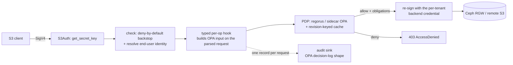

# s0

**An OPA/ABAC-enforcing, S3-compatible authorization gateway.**

s0 terminates the S3 protocol, makes a per-request OPA decision on the *parsed* request,
and re-issues allowed requests to a backend under a per-tenant credential. Enforcement
lives in the gateway's own policy — never in a backend-native feature — so one access
model holds uniformly over Ceph RGW and any remote S3, with one per-end-user audit trail.

It is built in Rust on [`s3s`](https://github.com/Nugine/s3s), which handles the S3 wire
protocol and SigV4.

It is **not** a byte proxy with an authorization hook bolted on. `s3s` deserializes each
request into a typed value; OPA decides on *that* value; `s3s-aws` re-issues the request
to the backend **from the same value**. Every operation s0 supports is one it owns.
Operations it does not own are denied, not passed through.

---

## Supported operations

s0 knows all **99** operations in the `s3s` 0.14.1 surface. **23** are enforced and
forwarded; the other **76** are refused with `403 AccessDenied`. There is no third
category — an operation with no entry in the table cannot reach a backend.

The table is [`src/access/optable.rs`](src/access/optable.rs) and it is the only source
of truth. `tests/gate_blackbox.rs` drives every refused operation as a signed HTTP
request through the real gate, and `tests/readme_optable.rs` fails if the counts below
drift from the table.

### Enforced (23)

Each is authorized against one of six grant verbs. A grant is per-subject, per-bucket,
per-verb, with object-prefix scopes.

| Grant verb | Operations |
|---|---|
| `read` | `HeadBucket`, `GetBucketLocation`, `ListBuckets` |
| `read_objects` | `GetObject`, `HeadObject`, `GetObjectAttributes`, `GetObjectTagging`, `ListParts` |
| `list_objects` | `ListObjects`, `ListObjectsV2`, `ListMultipartUploads` |
| `write_objects` | `PutObject`, `PostObject`, `CopyObject`, `CreateMultipartUpload`, `UploadPart`, `UploadPartCopy`, `CompleteMultipartUpload`, `AbortMultipartUpload` |
| `delete_objects` | `DeleteObject`, `DeleteObjects` |
| `write_object_tags` | `PutObjectTagging`, `DeleteObjectTagging` |

That covers ordinary object storage: get/put/head/delete, multipart upload, server-side
copy, listing, and object tagging.

### Not supported (76)

**Bucket lifecycle and configuration — 63 operations.** Every `*BucketAcl`, `*BucketPolicy`,
`*BucketCors`, `*BucketEncryption`, `*BucketVersioning`, `*BucketLifecycle`,
`*BucketReplication`, `*BucketNotification`, `*BucketTagging`, `*PublicAccessBlock`,
`*BucketWebsite`, `*BucketLogging`, inventory/metrics/analytics/tiering configuration,
plus `CreateBucket` and `DeleteBucket`.

This is a deliberate scope boundary, not a gap: **s0 is a data-plane gateway.** A bucket
created or destroyed through S3 has no record in whatever control plane owns the bucket,
and a bucket policy or CORS document written through S3 changes who can reach the data
with nothing upstream knowing. Those five verbs (`create_bucket`, `delete_bucket`,
`read_bucket_config`, `write_bucket_config`, `write_object_acl`) are held in
`NON_GATEWAY_VERBS` as a classification only — three tests hold that set disjoint from the
grantable vocabulary, so flipping one of these operations to enforced does not quietly
compile.

**Object-level operations outside the model — 11 operations.**

| Operation(s) | Why |
|---|---|
| `PutObjectAcl`, `GetObjectAcl` | Per-object ACLs are a second authorization system s0 would have to keep consistent with the bundle. Conferring an ACL is refused in code on every write path. |
| `PutObjectRetention`, `GetObjectRetention`, `PutObjectLegalHold`, `GetObjectLegalHold`, `PutObjectLockConfiguration`, `GetObjectLockConfiguration` | Object Lock / WORM. The grant vocabulary has no verb that could authorize defeating retention, so `x-amz-bypass-governance-retention` is refused unconditionally. |
| `RestoreObject` | Glacier-class restore; no verb, no backend parity. |
| `SelectObjectContent` | Server-side SQL over object contents — the response is a projection s0 cannot authorize at object granularity. |
| `GetObjectTorrent` | Legacy. |
| `ListObjectVersions` | Versioned listing is not modelled; the prefix-scoping rules below apply to the unversioned listing only. |
| `ListDirectoryBuckets` | S3 Express One Zone directory buckets are out of scope. |

**Structurally unauthorizable — 2 operations.** These are refused *ahead of* the coverage
table, so no pushed policy can enable them:

- **`CreateSession`** returns backend session credentials the client would then use
  directly against the backend — a permanent, total bypass of the gateway.
- **`WriteGetObjectResponse`** carries neither a bucket nor a key. There is nothing to
  authorize.

### Other known limits

- **Versioning**: `version_id` rides into the OPA input on the operations that accept it,
  but there is no version-aware grant shape and no versioned listing.
- **SSE-C / KMS**: encryption headers pass through to the backend; s0 does not authorize
  on them.
- **Presigned URLs** are supported (the STS session token is resolved from the query
  string), and the presigned credential is redacted from the audit record.
- **Anonymous access** is never allowed. There is no public-bucket concept.

---

## What it enforces

- **Object-level, per-prefix, per-operation** authorization — not bucket-granular
  ([`policy/gateway/authz.rego`](policy/gateway/authz.rego)).
- **Blind spots an in-backend hook cannot see**, all authorized on the parsed request:
  - `CopyObject` / `UploadPartCopy` **source** — authorizes the source read *and* the
    destination write;
  - `DeleteObjects` **keys** — authorizes *each* key, and strips denied keys from the
    forward rather than failing or allowing the batch;
  - `PostObject` form-upload **key**.
- **Request riders**: canned ACLs and `x-amz-grant-*` headers, inline `x-amz-tagging`, and
  `x-amz-bypass-governance-retention` are read and enforced rather than riding through
  unexamined. The answer is a **denial, never a silent strip** — a strip answers `200` to
  a request whose intent was not honoured.
- **List scoping, AWS-shaped**: an **unbounded** `ListObjectsV2` — no prefix at all — is
  **denied** for a prefix-scoped principal, exactly as `s3:ListBucket` with an `s3:prefix`
  condition denies it in AWS. A prefix *wider* than the grant but overlapping it is
  rewritten down to the grant, or fanned out across several. s0 does not narrow a listing
  the caller did not scope: a silently filtered listing reads as the whole bucket.
- **Live policy and live revocation**: OPA holds the policy; a revoked grant denies on the
  next request. No policy is ever baked into a credential.
- **`freeze_writes`** org kill-switch, per-bucket denylist, and the grant superset.

### Fail-closed by construction

Three independent layers, and they only work together:

| Layer | What it stops |
|---|---|
| `check`, pre-deserialization | Denies anonymous requests and any operation the table does not mark `Enforced`. Emits a **gate** audit record naming the stage, operation and access-key id. |
| `AuthzProof` ([`src/access/proof.rs`](src/access/proof.rs)) | The enforce path mints a proof; the forward path requires one bound to the same operation. A typed hook that forgets to authorize cannot reach a backend — it fails with an internal error. |
| PDP error handling | Any PDP error, missing key, or unparseable decision denies. |

The table proves a hook *exists*; the proof proves it *ran*.

---

## Request path



The `s3s` pipeline, verified against 0.14.1 (see
[`docs/substrate-api.md`](docs/substrate-api.md)): SigV4 verify → region →
`S3Access::check` (no body) → body buffer → deserialize → **typed `S3Access` hook with the
full parsed input** → `S3::<op>` → backend.

---

## Policy: pushed, not baked in

The **control plane is the source of policy**. It pushes per-tenant grant data — optionally
with the rego module itself — to the gateway as a bundle. s0 is policy-content-agnostic:
it enforces whatever bundle is pushed, and a revocation lands on the next request.

A bundle carries `{ "policy": "<rego>", "data": { … } }`, or just the data — in which case
s0 falls back to the compiled-in default policy
([`policy/gateway/authz.rego`](policy/gateway/authz.rego)). That default is also the
local-development policy and the oracle the parity gate replays against.

Two engines sit behind one `Pdp` trait:

- **Sidecar OPA** (`mode: "sidecar"`) — the shipping default. OPA is fed the bundle
  out-of-band; s0 calls it over loopback.
- **Embedded regorus** (`mode: "embedded"`) — the in-process fast path, permitted in
  production only behind a dual-engine parity gate: the two engines must agree
  byte-for-byte over the golden corpus. See
  [ADR-005](docs/adr/ADR-005-pdp-engine-posture-and-parity-gate.md).

---

## Listeners

Four listeners on four ports, with three different authentication postures. **Which
posture applies is a property of the socket, never of the path** — a port where "is this
authenticated?" is answered by a route match is how a credential mint ends up answering
anonymously. `GatewayConfig::validate` refuses a config in which any two share a port.

| Port | What | Authentication | Exposure |
|---|---|---|---|
| `listen` (8014) | the S3 data plane | SigV4, per-request authorization | ingress-fronted; public |
| `admin_listen` (8016) | `/healthz` `/readyz` `/metrics` | **none, by construction** — a kubelet probe cannot present a secret | probes and scraping only; never the ingress |
| `sts_mint.listen` (8015) | `AssumeRoleWithWebIdentity` (AWS STS wire protocol) + a legacy bearer-OIDC exchange | **none, by design** — a valid web identity token *is* the credential, exactly as at `sts.amazonaws.com` | optional; absent unless configured. Own hostname when present. |
| `internal.listen` (8017) | `POST /internal/v1/sts/sessions` | `X-Shared-Secret`, constant-time | control plane only; never the ingress, never the data plane |

Two of these mint credentials, and they are deliberately not the same socket. 8017 accepts
*assertions* about a caller the control plane has already authenticated, and is
shared-secret authenticated. 8015 accepts no assertions at all — it derives the principal
from the token, the tenant from the `RoleArn`, and the organization from s0's own routing
table. Collapsing them would put the shared-secret boundary behind a routing decision.

The internal listener is absent unless `internal` is present in the config. A missing or
empty `internal.shared_secret` **refuses every request** — there is no unauthenticated
mode — and says so at `error` level once at startup. Fence it with a NetworkPolicy; the
secret is the second line, not the first.

---

## Getting a credential

Every S3 SDK can obtain one with stock configuration — the same shape an EKS pod uses for
IRSA, because it is the same call:

```
AWS_ROLE_ARN=arn:aws:iam::<tenant>:role/<tenant>-sts-role
AWS_WEB_IDENTITY_TOKEN_FILE=/var/run/secrets/…/token
AWS_ENDPOINT_URL_STS=https://<org>.s3-gw-sts.<domain>
AWS_ENDPOINT_URL_S3=https://<org>.s3-gw.<domain>
```

The SDK mints, reads `Expiration` off the XML response, and re-mints before it lapses.

The `RoleArn` carries the **tenant**, because an OIDC token generally cannot: the tenant is
a property of the resource being addressed, not of the user, so a user with three tenants
would need three values of a claim minted once at login. So the token proves *who* you are,
the `RoleArn` names *which tenant* you want to act in, and the organization is resolved
from s0's own tenant→org binding and never from a claim. **The role name confers nothing** —
s0 has no role objects; authority comes from the bundle at decision time.

STS is on its **own hostname**, not a path on the S3 host. Ceph RGW and MinIO fold the two
together; AWS does not, and neither does s0 — a path prefix would collide with a bucket
named `sts`, and folding an unauthenticated surface into the SigV4 data plane makes "is
this request authenticated?" a matter of parsing a POST body correctly on the public port.

Details of token acceptance — the configured audience list, and the additive bundle route
for tenant service accounts — are in [`src/webidentity.rs`](src/webidentity.rs).

### Own STS: no secret at rest

s0 verifies inbound SigV4 itself. For STS sessions the **secret is derived**,
`HMAC(master_keys[kid], kid ‖ 0x00 ‖ sid)`, from the access-key id — no per-session secret
is stored and no hot-path lookup happens. The session claims (sub, groups, tenant, org,
expiry) ride in a signed token bound to the same `sid`. Revocation stays live because
policy lives in OPA, not in the token ([`src/auth/sts.rs`](src/auth/sts.rs)).

Access-key ids are `HFST<kid>.<sid>`. The `kid` names the master key that derived the
secret, which is what makes master-key rotation **online** — replacing a single key would
otherwise 403 every live session at once, indistinguishable from a fleet-wide auth outage:

```jsonc
"sts": { "master_keys": { "k0": "<hex>", "k1": "<hex>" }, "current_kid": "k1", … }
//  1. add k1, deploy         2. current_kid -> k1, deploy  (k0 still verifies)
//  3. wait session_ttl_secs  4. delete k0, deploy          (stragglers fail closed)
```

The **signing** key is not yet a ring: the token names its master key but not its signing
key, so replacing it invalidates live sessions. Rotate it in a window.

---

## Module map

| Module | Role |
|---|---|
| [`authz`](src/authz) | the OPA input contract and the decision type — the core seam |
| [`pdp`](src/pdp) | `Pdp` trait; embedded regorus + sidecar OPA; revision-keyed decision cache |
| [`auth`](src/auth) | identity authority, own STS, long-lived derived keys |
| [`access`](src/access) | the OPA gate: deny-by-default `check` + typed per-op hooks |
| [`proxy`](src/proxy) | per-`(backend, tenant)` client pool and dispatch |
| [`audit`](src/audit) | one reasoned decision record per request; async, non-blocking, disk-spill |
| [`gateway`](src/gateway.rs) / [`server`](src/server.rs) | assembly and hardened hyper serving |
| [`admin`](src/admin.rs) / [`shutdown`](src/shutdown.rs) | `/healthz` `/readyz` `/metrics`; one signal, ordered drain |
| [`internal`](src/internal.rs) | the authenticated control-plane surface |
| [`mint`](src/mint.rs) / [`webidentity`](src/webidentity.rs) | the credential doors |

---

## Running

```bash
GATEWAY_CONFIG=/etc/s0/gateway.json cargo run --release
```

See [`docs/gateway.example.json`](docs/gateway.example.json) and
[`docs/bundle.example.json`](docs/bundle.example.json).

### More than one replica

s0 is a Deployment, not a singleton. Three consequences a single-replica deployment never
exercises:

- **The audit spill is per-pod.** It is read-whole / POST / delete-whole, correct only for
  a single writer. Give each pod its own path —
  `"spill_path": "/var/lib/s0/audit-spill-${POD_NAME}.ndjson"`, interpolated at config
  load — on node-local scratch (`emptyDir`). **A shared RWX volume is unsupported.** If two
  pods do land on one path, the second detects the `.owner` marker, relocates, and logs an
  error rather than deleting records it never read.
- **Readiness means "has polled the control plane"**, not "holds a bundle revision" — a
  revision is seeded from the local file at boot, so the weaker check would admit a
  stale-policy replica. `/readyz` gates on ≥1 successful poll, and fails from the moment
  SIGTERM arrives so the pod leaves the Service *before* it stops accepting.
- **The grace period must exceed ~45s.** SIGTERM → readiness fails → S3 front drains (≤30s)
  → internal API and mint drain → audit worker drains (≤10s) → admin listener stops last.
  Kubernetes' 30s default truncates the audit drain and loses records; set
  `terminationGracePeriodSeconds: 60`.

```yaml
livenessProbe:  { httpGet: { path: /healthz, port: 8016 } }   # never depends on the control plane
readinessProbe: { httpGet: { path: /readyz,  port: 8016 } }
```

The image is distroless, so an `exec` probe is impossible.

### Metrics that matter

`s0_audit_dropped_total` counts records this process is **known to have lost**. Any
non-zero value is an audit-integrity incident; alert on increase. It includes
`s0_audit_spill_abandoned_total` — records still in the local spill when the worker exits.
The spill is node-local and dies with the pod, so those are lost, not pending.

`s0_audit_gate_suppressed_total` is deliberately **not** part of that total. Gate denials
(unsigned requests, unenforced operations, rejected credentials) are the one audit stream
an unauthenticated caller controls the rate of, so they are budgeted — without a bound a
scanner could evict the decision records of real access. A sustained non-zero value means
someone is scanning.

---

## Build and test

Needs [OPA **1.13.1**](https://www.openpolicyagent.org/) on `PATH`. The dual-engine parity
gate is the only check that licenses the embedded regorus engine, so it **fails** when its
oracle is missing rather than skipping. `S0_ALLOW_NO_OPA=1` downgrades it loudly if you
genuinely cannot install one.

```bash
cargo build
cargo test                     # unit + typed-hook e2e + golden corpus + parity
                               #  + every refused operation driven over real HTTP
bash tests/e2e/run.sh                 # real stack: aws-cli -> gateway -> MinIO
PDP_MODE=sidecar bash tests/e2e/run.sh   # …the same scenarios against a real OPA sidecar

S0_CAPTURE_REGENERATE=1 cargo test --test golden_capture   # re-record the captured corpus
```

### What keeps the tests honest

| Property | How |
|---|---|
| the policy is tested against the *emitted* input, never a hand-written one | every fixture in [`tests/data/captured_inputs/`](tests/data/captured_inputs) is recorded at `GatewayAccess::decide`, the single funnel every PDP question passes through |
| a renamed or dropped input field fails the build | `OpaInput` carries `deny_unknown_fields`; every capture must round-trip, and adding a field is a compile error until `OPA_INPUT_FIELDS` is updated ([`tests/fixture_drift.rs`](tests/fixture_drift.rs)) |
| a policy cannot read a field the gateway never sends | every `input.<path>` in the shipped rego must resolve in a captured input — the exact failure that once left 35 rego tests green over a deny-all production |
| every refused operation is refused over real HTTP | all 76 are driven as signed requests through the real `check`, table-driven off s3s's own route table ([`tests/gate_blackbox.rs`](tests/gate_blackbox.rs)) |
| the embedded engine cannot be licensed by an absent oracle | the parity gate **fails** rather than skips when `opa` is missing, and the oracle version is pinned to production's in CI, docker-compose and the test itself ([`tests/parity.rs`](tests/parity.rs)) |
| cursors and cache keys survive a rebuild | `content_revision` / `scope_hash` are SHA-256, pinned by [`tests/golden_hash.rs`](tests/golden_hash.rs) — `DefaultHasher` is not stable across toolchains |
| a configured secret cannot be printed | every plaintext credential is a `Secret<String>` whose `Debug` renders `Secret(<redacted>)`, with no `Display` and no `Serialize` ([`src/secret.rs`](src/secret.rs)) |
| this README's operation counts match the code | [`tests/readme_optable.rs`](tests/readme_optable.rs) |

### Integrating with a control plane

s0 and whatever control plane pushes its bundles must agree on the rego entrypoint
(`data.s3.authz.decision`). Disagreement fails *silently*: a package the entrypoint does
not address evaluates to `undefined`, and everything is denied.

[`tests/external_bundle.rs`](tests/external_bundle.rs) pins it by replaying a **real
serialized bundle** produced by a third-party control plane
([`tests/data/platform/`](tests/data/platform)) through s0's production `parse_bundle` →
`reload` → `decide` path, asserting that a granted read comes back **allow**. A matching
package name that still evaluates to `undefined` is exactly the deny-all bug; only an
allow rules it out.

---

## Dependency policy

`s3s` is experimental, effectively single-maintainer, and on the critical path. It is
pinned to the **exact** version (`s3s = "=0.14.1"`) so upgrades are deliberate events.
`s3s-aws` is pinned just as hard and for a stronger reason: the gate's safety argument —
"an operation with no hook falls through to `NotImplemented`" — is a claim about which
methods `s3s-aws`'s generated `Proxy` overrides. A patch bump that overrode one more would
open a forwarding path with no test failing. Guarded by `tests/op_coverage.rs`.

A conformance suite against a live backend is scaffolded in
[`.github/workflows/conformance.yml`](.github/workflows/conformance.yml). **It is not yet
wired** — the harness step exits 1 by design — so it does not currently gate anything.

To make an upgrade fully hermetic, vendor the tree and review the diff on each bump:

```bash
cargo vendor vendor/
printf '[source.crates-io]\nreplace-with = "vendored"\n[source.vendored]\ndirectory = "vendor"\n' >> .cargo/config.toml
```

---

## Releasing

s0 ships as a container image from its own repository on its own version line; a consumer
pins a tag and never builds s0. **CI is the only thing that publishes the image** —
[`scripts/release-image.sh`](scripts/release-image.sh) refuses to push anywhere but GitHub
Actions. The full procedure and the reasoning behind it are in
[`docs/releasing.md`](docs/releasing.md).

## Design records

Architecture decisions: [`docs/adr/`](docs/adr). Substrate API reference (`s3s`, `s3s-aws`,
`regorus`): [`docs/substrate-api.md`](docs/substrate-api.md).

## Contributing

See [`CONTRIBUTING.md`](CONTRIBUTING.md). Security reports: [`SECURITY.md`](SECURITY.md).

## License

Business Source License 1.1, converting to Apache-2.0 on the change date
(`2030-07-15`, four years after first publication). See [`LICENSE`](LICENSE); the future
Apache text is in [`LICENSE-APACHE-2.0.txt`](LICENSE-APACHE-2.0.txt).
