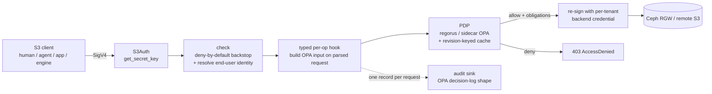

# Hyperfluid S3 Authorization Gateway

A self-owned, S3-compatible **authorization gateway** that fronts heterogeneous
object-storage backends (Ceph RGW "storage bays" and remote S3) and enforces
Hyperfluid's access model uniformly, with **OPA** as the policy brain. Built in Rust
on the [`s3s`](https://github.com/Nugine/s3s) crate (S3 protocol + SigV4 handled for
us).

It is **not** a proxy with an authz hook bolted on. `s3s` deserializes each request
into a typed input; OPA decides on *that* input; and `s3s-aws` re-issues the request
to the backend **from the same value**. Every operation it supports is one it owns;
operations it does not own are denied, not passed through.

> Enforcement lives in the gateway's own policy, never in a backend-native feature —
> so one model holds over Ceph today and a "dumb" S3 bay tomorrow, with one per-user
> audit trail. This is the primary reason the platform is taking the gateway route:
> for regulated (e.g. hospital) deployments, **every object access — human, app, or
> engine — must be authorized as the end-user and recorded as one OPA decision.**

## Request path



Confirmed `s3s` pipeline (verified against 0.14.1 — see [`docs/substrate-api.md`](docs/substrate-api.md)):
SigV4 verify → region → `S3Access::check` (no body) → body buffer → deserialize →
**typed `S3Access` hook (full parsed input)** → `S3::<op>` → backend.

## What it enforces

- **Object-level, per-prefix, per-operation** authorization — not bucket-granular.
  The rego consumes a per-subject/per-bucket/per-op grant with object-prefix scopes
  ([`policy/gateway/authz.rego`](policy/gateway/authz.rego)).
- **Blind spots the in-RGW hook cannot see**, all authorized on the parsed request:
  - CopyObject **source** (authorizes source read *and* dest write),
  - multi-delete **keys** (authorizes *each* key; strips denied keys from the forward),
  - POST form-upload **key**.
- **Unbounded list narrowing** (§5.1): a prefix-scoped `ListObjectsV2` with no prefix
  is rewritten to the granted prefix instead of enumerating the bucket.
- **Live policy / live revocation**: OPA holds the policy; a revoked grant denies on
  the next request. No policy is baked into credentials.
- **`freeze_writes`** org kill-switch and per-bucket denylist (today's model), plus
  the grant superset.

## Security invariants (PROMPT §6) and where they live

| Invariant | Where |
|---|---|
| §6.1 live policy / revocation | OPA is the brain; bundle refresh reloads engine + bumps revision ([`bundle_refresh.rs`](src/bundle_refresh.rs)) |
| §6.2 deny-by-default incl. typed seam | `check` denies any op not on the implemented allowlist ([`access/mod.rs`](src/access/mod.rs)); PDP errors fail closed |
| §6.3 canonicalize before forward | decision + forward derive from the same `S3Request` value; no raw passthrough |
| §6.4 blast radius | per-`(backend,tenant)` backend credentials ([`proxy/mod.rs`](src/proxy/mod.rs)) |
| §6.5 every consumer through the gateway | one path; engines present a per-user credential (ADR-001, ADR-006) |
| §6.6 one per-user record per request | [`audit/`](src/audit) — OPA decision-log shape, org in a trusted label |
| §6.7 backend-agnostic enforcement | policy in the gateway; own STS; never a backend IAM/STS/hook |

## Module map

| Module | Role |
|---|---|
| [`authz`](src/authz) | OPA input contract (§5) + decision/obligations — the core seam |
| [`pdp`](src/pdp) | `Pdp` trait; embedded regorus (`CompiledPolicy`) + sidecar OPA; revision-keyed cache |
| [`auth`](src/auth) | identity authority + own STS (derived session secrets, no secret at rest) |
| [`access`](src/access) | the OPA gate: deny-by-default `check` + typed per-op hooks |
| [`proxy`](src/proxy) | per-`(backend,tenant)` client pool + dispatch over `s3s_aws::Proxy` |
| [`audit`](src/audit) | one reasoned decision record per request, async, non-blocking, disk-spill |
| [`gateway`](src/gateway.rs) / [`server`](src/server.rs) | assembly + hardened hyper serving |

## Own STS (no secret at rest, revocation stays live)

The gateway verifies inbound SigV4 itself. For STS sessions the **secret is derived**
`HMAC(master, sid)` from the access-key id — no per-session secret is stored and no
hot-path lookup happens. The session **claims** (sub, groups, tenant, org, expiry)
ride in a signed token bound to the same `sid`. Revocation stays live because policy
lives in OPA, not the token ([`auth/sts.rs`](src/auth/sts.rs)).

## Build / test / run

```bash
cargo build
cargo test        # 19 unit + end-to-end hook tests + 23-case golden decision corpus
```

Run against a config (see [`docs/gateway.example.json`](docs/gateway.example.json) and
[`docs/bundle.example.json`](docs/bundle.example.json)):

```bash
GATEWAY_CONFIG=/etc/hyperfluid-gateway/gateway.json cargo run --release
```

`mode: "embedded"` uses the in-process regorus engine (fast path); `mode: "sidecar"`
talks to a loopback OPA. The two engines are held behind one `Pdp` trait and must
agree byte-for-byte (dual-engine parity gate, ADR-005).

## Validated vs. follow-ups

**Validated in CI:** the rego decision logic (23-case golden corpus through regorus),
STS crypto, the enforcement path through the real typed hooks (allow/deny, multi-delete
per-key filtering, list narrowing), audit record shape.

**Tracked follow-ups** (see [`docs/adr/`](docs/adr)): multi-prefix list fan-out
(currently fails closed, ADR-004); object-tag ABAC (gated on §7.1, ADR-003); multipart
upload ops; POST-form forwarding (authorized but `s3s_aws::Proxy` lacks `post_object`);
the companion console-side grant projection (ADR-006) and Ceph/S3 audit extractor
(ADR-002); the direct-credential closure (ADR-001).

## Design records

Substrate API reference: [`docs/substrate-api.md`](docs/substrate-api.md). Decisions on
the brief's open questions: [`docs/adr/`](docs/adr).
