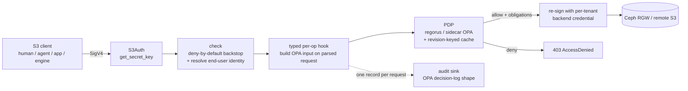

# s0

**An OPA/ABAC-enforcing, S3-compatible authorization gateway.**

s0 is a self-owned S3 authorization gateway. It fronts heterogeneous object-storage
backends (Ceph RGW and remote S3) and enforces one access model uniformly, with **OPA**
as the policy brain. It is built in Rust on the [`s3s`](https://github.com/Nugine/s3s)
crate, which handles the S3 protocol and SigV4.

It is **not** a byte proxy with an authorization hook bolted on. `s3s` deserializes each
request into a typed value; OPA decides on *that* value; and `s3s-aws` re-issues the
request to the backend **from the same value**. Every operation it supports is one it
owns; operations it does not own are denied, not passed through.

> Enforcement lives in the gateway's own policy, never in a backend-native feature — so
> one model holds over Ceph today and a "dumb" S3 backend tomorrow, with one per-user
> audit trail. For regulated deployments, **every object access — human, app, or engine —
> is authorized as the end-user and recorded as one OPA decision.**

## Request path



The `s3s` pipeline (verified against 0.14.1 — see [`docs/substrate-api.md`](docs/substrate-api.md)):
SigV4 verify → region → `S3Access::check` (no body) → body buffer → deserialize →
**typed `S3Access` hook (full parsed input)** → `S3::<op>` → backend.

## What it enforces

- **Object-level, per-prefix, per-operation** authorization — not bucket-granular. The
  rego consumes a per-subject/per-bucket/per-op grant with object-prefix scopes
  ([`policy/gateway/authz.rego`](policy/gateway/authz.rego)).
- **Blind spots the in-backend hook cannot see**, all authorized on the parsed request:
  - CopyObject **source** (authorizes source read *and* dest write),
  - multi-delete **keys** (authorizes *each* key; strips denied keys from the forward),
  - POST form-upload **key**.
- **Unbounded list narrowing**: a prefix-scoped `ListObjectsV2` with no prefix is
  rewritten to the granted prefix instead of enumerating the whole bucket.
- **Live policy / live revocation**: OPA holds the policy; a revoked grant denies on the
  next request. No policy is baked into credentials.
- **`freeze_writes`** org kill-switch and per-bucket denylist, plus the grant superset.

## Policy: pushed, not baked in

The **platform is the source of policy**. It projects per-tenant grant data and pushes it
— optionally with the rego module itself — to the gateway as a bundle. The gateway is
policy-content-agnostic: it enforces whatever bundle is pushed, and a revocation lands on
the next request.

Two engines sit behind one `Pdp` trait:

- **Sidecar OPA** — the shipping default. OPA is fed the bundle out-of-band; the gateway
  calls it over loopback.
- **Embedded regorus** — the in-process fast path, permitted in production only behind a
  dual-engine parity gate (the two engines must agree byte-for-byte; see
  [ADR-005](docs/adr/ADR-005-pdp-engine-posture-and-parity-gate.md)). It loads the pushed
  module in-process.

A bundle may carry `{ "policy": "<rego>", "data": { … } }`, or just the data — in which
case the gateway falls back to the compiled-in default policy
([`policy/gateway/authz.rego`](policy/gateway/authz.rego)). That default is also the
local-development policy and the oracle the parity gate replays against.

## Own STS (no secret at rest, revocation stays live)

The gateway verifies inbound SigV4 itself. For STS sessions the **secret is derived**
`HMAC(master, sid)` from the access-key id — no per-session secret is stored and no
hot-path lookup happens. The session **claims** (sub, groups, tenant, org, expiry) ride
in a signed token bound to the same `sid`. Revocation stays live because policy lives in
OPA, not the token ([`src/auth/sts.rs`](src/auth/sts.rs)). An optional OIDC mint exchanges
an identity-provider token for a gateway session ([`src/mint.rs`](src/mint.rs)).

## Module map

| Module | Role |
|---|---|
| [`authz`](src/authz) | OPA input contract + decision/obligations — the core seam |
| [`pdp`](src/pdp) | `Pdp` trait; embedded regorus (`CompiledPolicy`) + sidecar OPA; revision-keyed cache |
| [`auth`](src/auth) | identity authority + own STS (derived session secrets, no secret at rest) |
| [`access`](src/access) | the OPA gate: deny-by-default `check` + typed per-op hooks |
| [`proxy`](src/proxy) | per-`(backend, tenant)` client pool + dispatch over `s3s_aws::Proxy` |
| [`audit`](src/audit) | one reasoned decision record per request, async, non-blocking, disk-spill |
| [`gateway`](src/gateway.rs) / [`server`](src/server.rs) | assembly + hardened hyper serving |

## Security properties and where they live

| Property | Where |
|---|---|
| live policy / revocation | OPA is the brain; bundle refresh reloads the engine + bumps the revision ([`bundle_refresh.rs`](src/bundle_refresh.rs)) |
| deny-by-default incl. the typed seam | `check` denies any op not on the implemented allowlist ([`access/mod.rs`](src/access/mod.rs)); PDP errors fail closed |
| canonicalize before forward | decision + forward derive from the same `S3Request` value; no raw passthrough |
| blast radius | per-`(backend, tenant)` backend credentials ([`proxy/mod.rs`](src/proxy/mod.rs)) |
| every consumer through the gateway | one path; engines present a per-user credential |
| one per-user record per request | [`audit/`](src/audit) — OPA decision-log shape, org in a trusted label |
| backend-agnostic enforcement | policy in the gateway; own STS; never a backend IAM/STS/hook |

## Build / test / run

```bash
cargo build
cargo test              # unit + typed-hook e2e + golden decision corpus + dual-engine parity
bash tests/e2e/run.sh   # real-stack: aws-cli -> gateway -> MinIO (needs Docker)
```

Run against a config (see [`docs/gateway.example.json`](docs/gateway.example.json) and
[`docs/bundle.example.json`](docs/bundle.example.json)):

```bash
GATEWAY_CONFIG=/etc/s0/gateway.json cargo run --release
```

`mode: "embedded"` uses the in-process regorus engine (fast path); `mode: "sidecar"`
talks to a loopback OPA. The two engines are held behind one `Pdp` trait and must agree
byte-for-byte (dual-engine parity gate, ADR-005).

## Dependency policy

`s3s` is experimental and effectively single-maintainer, and it is on the critical path.
It is pinned to the **exact** version (`s3s = "=0.14.1"`) so upgrades are deliberate
events, gated by a conformance suite ([`.github/workflows/conformance.yml`](.github/workflows/conformance.yml))
run per backend vendor. To make an upgrade fully hermetic, vendor it —
`cargo vendor vendor/ && printf '[source.crates-io]\nreplace-with = "vendored"\n[source.vendored]\ndirectory = "vendor"\n' >> .cargo/config.toml` — and review the diff on each bump.

## Design records

Substrate API reference: [`docs/substrate-api.md`](docs/substrate-api.md). Architecture
decisions: [`docs/adr/`](docs/adr).

## License

Business Source License 1.1, converting to AGPL-3.0-or-later on the change date. See
[`LICENSE`](LICENSE); the future AGPL text is in [`LICENSE-AGPL-3.0.txt`](LICENSE-AGPL-3.0.txt).
